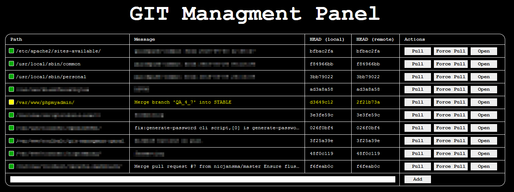

GIT Managment Panel
===================

git-managment-panel is a small webpage to display and manipulate git repositories on your linux server.

This web interface displays a list of all (configured) repositories, their local commit-hash and the HEAD of the remote branch.  
Repositories that can be pulled are highlighted and can be pulled directly from the web interface, this even works for repositories not owned by the web-user account.

## Installation

1. Clone this repository
2. Navigate to the script with your web browser and add repositories via the [Add] button.

## Configuration

The standard configuration should from out-of-the-box, but if you want to change some settings simply create a file `config_user.php` in the root directory with the following content:
~~~php
<?php

return
[
	// add your settings here, see config.php for available keys
];
~~~

## Remote Passwords

The normal git commands are invoked to get the remote state, pull the repo etc.  
If the remote needs a password be sure to have a git-credential helper configured for your web-user (and - if needed - for the repository owner).

The simplest variant is probably credential.helper store:

~~~
// rember credenttials forever
$ git config --global credential.helper store

// enter your data once and they will be stored in ~/.git-credentials
$ git pull
~~~

## Superuser trickery

if you want to view repositories that you do not own you simply need to make the repository readable by the web-user (e.g. `www-data` for apache).

But if you also want to be able to pull the repository you will need to use the sudopull script:

1. copy the file `sudopull` from the tools directory somewhere on your machine (e.g `/usr/local/sbin`)
2. make the file executable (`chmod +Xx /usr/local/sbin/sudopull`)
3. configure sudo to not ask for a password

~~~
$ visudu

// add this line
ALL ALL=NOPASSWD: /usr/local/sbin/sudopull  

// then save the file
~~~

4. configure git-managment-panel to use the sudopull script by editing/creating the file `config_user.php` in the root directory with the following content:

~~~php
<?php

return
[
	'use_sudopull' => true,
	'sudopull_path' => '/usr/local/sbin/sudopull',
];
~~~

> **Note**
>
> As always the rule-of-thumb is: before you give a script unrestricted sudo access look at its content to ensure it's not doing bad stuff (and in this case its ~ 30 lines)  
> Also you don't *need* to use sudopull, as long as all repositories are read- & writable by the apache user everything works good without it